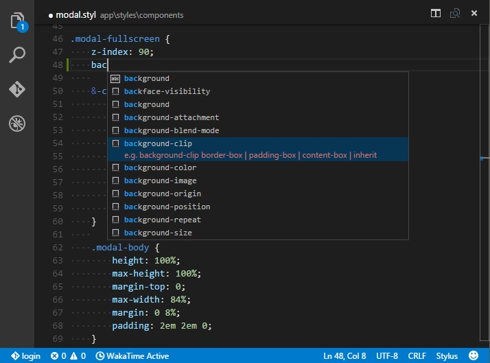

# Stylus Support for Visual Studio Code

Simple syntax coloring and nice code snippets based on [Stylus Clean Completions](https://github.com/lnikell/stylus-clean-completions).

## Install

Open up VS Code and hit F1 then type *ext*, select *install* and type *stylus*. Hit enter and reload the window to enable.

## What you get:
* Syntax coloring
* Code Snippets

## Missing properties? Suggestions? Problems?

Talk to me on [twitter](https://twitter.com/AlanCezarAraujo) or feel free to change the [source](https://github.com/AlanCezarAraujo/vs-code-stylus).

## Credits
Many thanks to
* [Dmitriy Kubyshkin](dmitriy@kubyshkin.ru) for the Language Definition.
* [Alex B.](https://github.com/lnikell) for his awesome [Stylus Clean Completions](https://github.com/lnikell/stylus-clean-completions)

## For more information, please visit:
* [Visual Studio Code](http://code.visualstudio.com/)
* [Stylus](https://learnboost.github.io/stylus/)
* [Stylus Clean Completions](https://github.com/lnikell/stylus-clean-completions)
